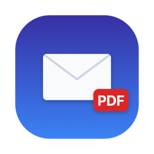

<p align="center">
  
</p>

# MailToPDF

A small native macOS menubar app for turning emails into PDFs. Drag a message
out of Apple Mail, or drop a `.eml` file from Finder, straight onto the
menubar icon, and get a paginated A4 PDF back. Any PDF attachments on the
email are extracted and saved alongside it. Built for bookkeeping: converting
invoices and receipts that arrive by email into files you can archive.

## Menubar usage

MailToPDF has no Dock icon and no regular window (`LSUIElement`); it lives
entirely in the menubar.

- **Drop a message or `.eml` file directly onto the menubar icon** to convert
  it. This works even while the popover is closed.
- **Left-click** the icon to open/close a popover with the same drop zone,
  a "Datei auswählen…" file picker, and the status/preview UI.
- **Right-click** the icon for a menu with "Einstellungen…" (Cmd+,, a
  settings window with a "Bei Anmeldung starten" launch-at-login toggle plus
  app info and a link to the author's site) and "Beenden" (Cmd+Q) to quit.
- The icon briefly swaps to a checkmark or an x to confirm success or
  failure, even if the popover is closed at the time.
- **A small drop shelf fades in just below the cursor** whenever
  you start dragging a Mail message or a `.eml` file anywhere in the system,
  so you don't have to aim for the menubar icon or hover the very top edge
  of the screen (which can trigger Mission Control). It works over
  fullscreen apps and on every Space. Drop on it and it turns into a live
  status card right there, showing conversion progress and the page preview
  before the save panel appears, instead of just disappearing.
  Privacy note: drag detection only inspects drag types system-wide, and file
  URLs are read only for file drags to check for a `.eml` extension; nothing
  is logged or transmitted.

## What it does

- Accepts a dragged Mail.app message or a `.eml` file, dropped on the
  menubar icon or on the popover's drop zone (or picked via the file picker).
- Parses the MIME structure (headers, multipart bodies, charsets, transfer
  encodings) with a small hand-rolled parser, no third-party dependencies.
- Renders the HTML body (or a plain-text fallback) into a paginated A4 PDF,
  with a small header block (From, Subject, Date) prepended.
- Extracts PDF attachments (by content type or a filename ending in .pdf)
  and writes them next to the saved email PDF.
- Shows a live status card while converting (subject line, then a page-1
  preview of the rendered PDF) in whichever surface you dropped on (popover,
  drop shelf, or just the menubar icon), then opens a centered save dialog
  with a smart suggested filename, and saves where you chose. Once per
  dropped email.

## Smart filenames

When a merchant name and a total amount can be extracted from the email, the
suggested filename becomes `YYYY-MM-DD <Merchant> <Amount>.pdf` instead of
the date-plus-subject default. On a Mac with Apple Intelligence available,
extraction runs entirely on-device via Apple's FoundationModels framework;
nothing leaves the Mac, and it is raced against an 8 second timeout. When
Apple Intelligence isn't available (or times out), a regex-based fallback
looks for the sender's display name and the largest EUR amount mentioned in
the email. Either way, if nothing can be extracted, the filename falls back
to the date-plus-subject default.

## Requirements

- Runtime: macOS 15 or later
- Build: Xcode 26 or later (the code does an unconditional `import
  FoundationModels`, a macOS 26 SDK framework)
- Optional: Apple Intelligence enabled on a macOS 26+ Mac, for on-device
  smart filenames; without it, extraction falls back to the regex heuristic
- [XcodeGen](https://github.com/yonaskolb/XcodeGen) (`brew install xcodegen`)

## Building

The Xcode project itself is generated, not checked in.

```sh
xcodegen generate
open MailToPDF.xcodeproj
```

Or build from the command line:

```sh
xcodegen generate
xcodebuild -project MailToPDF.xcodeproj -scheme MailToPDF build -destination 'platform=macOS'
```

The app icon is generated by `swift scripts/generate-icon.swift`, which
rewrites the PNGs in the asset catalog.

## Testing

```sh
xcodebuild -project MailToPDF.xcodeproj -scheme MailToPDF test -destination 'platform=macOS'
```

Tests cover the MIME parser (`EmailParser`): header decoding (RFC 2047),
multipart recursion, quoted-printable/base64 transfer decoding, charset
handling, date parsing, and PDF attachment extraction. The PDF rendering
pipeline itself (WKWebView + NSPrintOperation) is not unit-testable headlessly
and is verified by building and by manual testing.

## How the Mail drag works

Modern Mail.app no longer puts a file promise on the drag pasteboard, only a
custom `com.apple.mail.PasteboardTypeMessageTransfer` type. To read the
dragged message(s), the app asks Mail for the raw source of the current
selection via AppleScript (`NSAppleScript`, not `osascript`, so the macOS
automation prompt attributes correctly to this app). A drag always carries
the selected message(s), so dragging several selected messages converts all
of them.

The first drag from Mail triggers a one-time macOS Automation permission
prompt ("MailToPDF wants access to control Mail"). This has to be granted for
the Mail drag path to work; it can be managed later under System Settings >
Privacy & Security > Automation.

Dropping a `.eml` file from Finder, or a file promise from another app that
still provides one, does not require this permission and works as a
fallback path.

## Limitations

- The save location is asked for on every drop; there is no "always save to
  this folder" setting.
- Only PDF attachments (by content type or a filename ending in .pdf) are
  extracted; other attachment types (images, Word documents, etc.) are
  ignored.
- No support for `.msg` (Outlook) or other non-MIME email formats.

## License

MIT, see [LICENSE](LICENSE).
